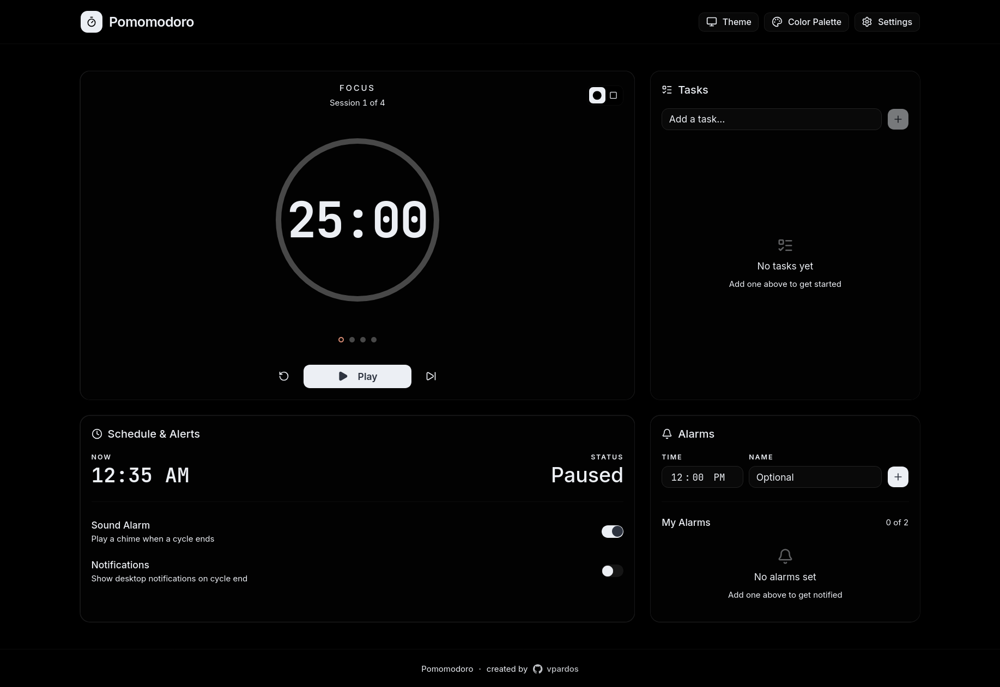

# Pomomodoro

A beautiful, interactive Pomodoro timer built with Next.js 16 and React 19.

Live at [https://pomomodoro.vpardos.dev](https://pomomodoro.vpardos.dev)

   



## Features

- **Pomodoro Timer** — Work/short break/long break phases with stunning visual feedback
- **Customizable Durations** — Configure work, short break, long break durations and long break interval
- **Circular & Linear Progress** — Two timer visual styles with phase-specific glow effects and breathing animations while running
- **Ambient Background** — Subtle, slowly drifting gradient blobs that shift with the current timer phase
- **Sound Notifications** — Sound on phase transitions
- **Browser Notifications** — Notifications on phase changes
- **Alarm System** — Schedule alarms for specific times with sound/notification alerts
- **Task System** — Track up to 5 tasks with check-to-complete, bouncy animations, and fluid interactions
- **Theme System** — Light/dark/OLED modes with 13 color palettes
- **Glassmorphism UI** — Cards with hover lift, backdrop blur, and smooth transitions throughout
- **Smooth Scrolling & Custom Scrollbar** — Themed, thin scrollbars across all browsers
- **Settings Persistence** — All settings saved to localStorage
- **Dynamic Page Title** — Shows remaining time and current phase in browser tab

## Getting Started

### Prerequisites

- Node.js 18+ 
- npm, yarn, or pnpm

### Installation

```bash
# Clone the repository
git clone https://github.com/vpardoss/Pomomodoro.git
cd Pomomodoro

# Install dependencies
npm install
```

### Development

```bash
# Start the development server
npm run dev
```

Open [http://localhost:3000](http://localhost:3000) in your browser.

### Build

```bash
# Create production build
npm run build

# Start production server
npm start
```

### Lint

```bash
# Run ESLint
npm run lint
```

## Tech Stack

- **Framework**: Next.js 16.2.10 with App Router
- **UI Library**: React 19
- **Styling**: Tailwind CSS v4
- **UI Components**: shadcn/ui v4 with @base-ui/react
- **Icons**: lucide-react
- **Language**: TypeScript

## Design System

### Animations

The app includes a rich set of custom CSS keyframe animations defined in `src/app/globals.css`:

- `animate-fade-in-up` — Staggered card entrance animations
- `animate-breathe` — Subtle scale pulsing on the timer while running
- `animate-pulse-ring` — Expanding ring effect on the current session dot
- `animate-blob-drift` — Slow ambient background blob movement
- `animate-slide-in-right` — List item entry animations
- `animate-spring-scale` — Bouncy pop-in effect
- `animate-float` — Gentle floating motion for empty states
- `animate-shimmer` — Linear gradient sweep effect

### Color Palettes

13 carefully crafted palettes are available:

**Catppuccin**: Latte, Frappé, Macchiato, Mocha
**Nord**: Polar Night, Snow Storm, Frost, Aurora
**Extras**: Dracula, Solarized Light, Solarized Dark, Tokyo Night, Rosé Pine

Each palette is dynamically applied via CSS custom properties using OKLCH (Catppuccin) or hex values (custom palettes).

## License

MIT


## Acknowledgments

- [Catppuccin](https://catppuccin.com/) — Themes
- [Dracula](https://draculatheme.com/) — Themes
- [Nord](https://www.nordtheme.com/) — Themes
- [Solarized](https://ethanschoonover.com/solarized/) — Themes
- [Tokyo Night](https://github.com/enkia/tokyo-night-vscode-theme) — Themes
- [Rosé Pine](https://rosepinetheme.com/) — Themes
- [shadcn/ui](https://ui.shadcn.com/) — Components
- [Next.js](https://nextjs.org/) — The React framework
- [Tailwind CSS](https://tailwindcss.com/) — CSS framework
