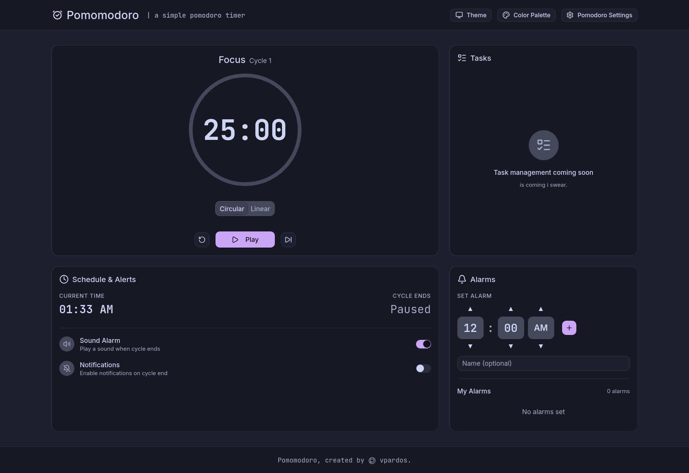

# Pomomodoro

A simple Pomodoro timer built with Next.js 16 and React 19.

   



## Features

- **Pomodoro Timer** — Work/short break/long break phases with automatic transitions
- **Customizable Durations** — Configure work, short break, long break durations and long break interval
- **Circular Progress Display** — Visual timer with phase-specific accent colors
- **Sound Notifications** — Web Audio API sound on phase transitions
- **Browser Notifications** — Native notifications on phase changes (with permission handling)
- **Alarm System** — Schedule alarms for specific times with sound/notification alerts
- **Theme System** — Light/dark/OLED modes with smooth transitions
- **Catppuccin Palettes** — Latte, frappe, macchiato, mocha flavor support
- **Settings Persistence** — All settings saved to localStorage
- **Dynamic Page Title** — Shows remaining time and current phase in browser tab
- **Responsive Layout** — Mobile-first design with grid adjustments

## Getting Started

### Prerequisites

- Node.js 18+ 
- npm, yarn, or pnpm

### Installation

```bash
# Clone the repository
git clone https://github.com/vpardoss/Pomomodoro.git
cd Pomomodoro

# Install dependencies
npm install
```

### Development

```bash
# Start the development server
npm run dev
```

Open [http://localhost:3000](http://localhost:3000) in your browser.

### Build

```bash
# Create production build
npm run build

# Start production server
npm start
```

### Lint

```bash
# Run ESLint
npm run lint
```

## Tech Stack

- **Framework**: Next.js 16.2.10 with App Router
- **UI Library**: React 19
- **Styling**: Tailwind CSS v4
- **UI Components**: shadcn/ui v4 with @base-ui/react
- **Theming**: @catppuccin/palette
- **Icons**: lucide-react
- **Language**: TypeScript

## Project Structure

```
src/
├── app/              # Next.js App Router pages and layouts
├── components/       # React components
│   ├── ui/          # shadcn/ui primitives (auto-generated)
│   ├── timer-display.tsx
│   ├── settings-dialog.tsx
│   ├── alarms-card.tsx
│   └── ...
├── hooks/           # Custom React hooks
│   ├── usePomodoro.ts
│   ├── useNotifications.ts
│   ├── useTheme.ts
│   └── usePalette.ts
└── lib/             # Utilities
    ├── utils.ts
    └── alarm.ts
```

## Architecture

### Core Hooks

- **`usePomodoro`** — Core timer logic with phase management, cycle tracking, and settings persistence
- **`useNotifications`** — Browser notifications, sound toggle, and alarm management
- **`useTheme`** — Light/dark/OLED mode switching with system preference detection
- **`usePalette`** — Catppuccin flavor application with theme-aware defaults

### Components

- **`TimerDisplay`** — Circular progress with time and phase display
- **`SettingsDialog`** — Duration configuration modal
- **`ScheduleCard`** — Sound/notification toggles and schedule info
- **`AlarmsCard`** — Alarm management interface
- **`PaletteSelector`** — Catppuccin flavor picker
- **`ThemeToggle`** — Theme mode switcher
- **`TaskPlaceholder`** — Placeholder for future task management feature

## Configuration

All settings are persisted in localStorage:

- `pomodoro-settings` — Timer durations (work, short break, long break, long break interval)
- `pomodoro-sound-enabled` — Sound notification toggle
- `pomodoro-notifications-enabled` — Browser notification toggle
- `pomodoro-alarms` — Scheduled alarms
- `pomodoro-theme` — Theme mode (light/dark/oled)
- `pomodoro-palette` — Catppuccin flavor preference

## Browser Support

- Modern browsers with ES6+ support
- Web Audio API for sound notifications
- Notification API for browser notifications

## License

MIT

## Author

**vpardoss** — [GitHub](https://github.com/vpardoss)

## Acknowledgments

- [Catppuccin](https://catppuccin.com/) — Themes
- [shadcn/ui](https://ui.shadcn.com/) — Components
- [Next.js](https://nextjs.org/) — The React framework
- [Tailwind CSS](https://tailwindcss.com/) — CSS framework
